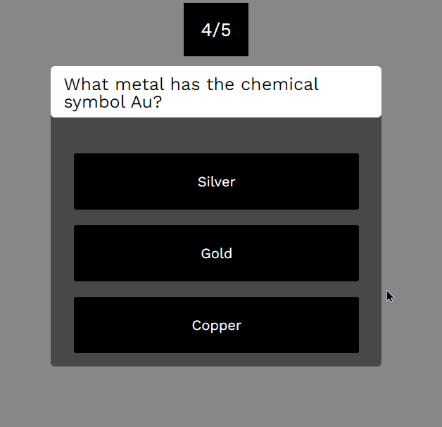

<h1 align="center">Quiz 👩‍💻❗❓</h1>

### ⚠ About 

This project was developed using HTML, CSS and JavaScript. The purpose of creating this project is to practice the logic behind a quiz creation using the <strong>JavaScript</strong> language.

 

---
### 🛠 Techs

The following tools were used in the construction of the project:

 - [HTML](https://www.w3schools.com/html/)
 - [CSS](https://www.w3schools.com/css/)
 - [JavaScript](https://www.javascript.com/)

---

### 🌟 Features

- [x] Responsive
  
   

  

You can change the questions and answers directly from the object in the website's JavaScript.

 
<h4 align="center"> 
	 Project completed ✅
</h4>

---
### Author

 

<a href="https://blog.rocketseat.com.br/author/thiago/">
 
  
 <b>Leonardo Oliveira 🚀</b></a> 
 

Made with 💜 by Leonardo Oliveira 👋!

